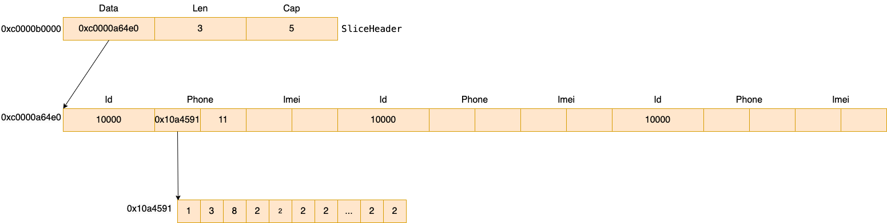

# slice 的内存布局

```
type SliceHeader struct {
	Data uintptr
	Len  int
	Cap  int
}
```

例如对于下面的实例代码

```
s := make([]Device, 0, 5)
s = append(s, Device{
    Id:    10000,
    Phone: "13822222222",
    Imei:  "967029040684350",
})

s = append(s, Device{
    Id:    10000,
    Phone: "13822222222",
    Imei:  "967029040684350",
})

s = append(s, Device{
    Id:    10000,
    Phone: "18938303322",
    Imei:  "879718719874831738",
})
```

其内存布局如下图所示



