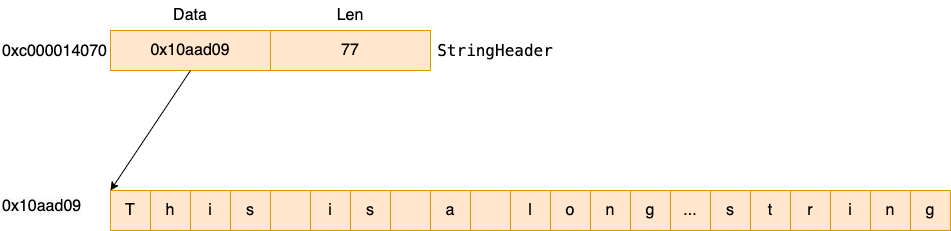

# 字符串类型
`var a string = 'I am a string!'`


# 字符串内存布局

一个字符串是由两个部分组成，一个是StringHeader，

```
type StringHeader struct {
	Data uintptr
	Len  int
}
```

例如对于以下字符串：

```
func main() {
	s := "Thiis is a long long long long long long long long long long long long string"
}
```



其StringHeader的值为
- Data：0x10aad09   指向数据段中的字符串
- Len：77


# []byte和string的转换
一般来说转换方式是采用string() 进行转换，但是这种方式会导致拷贝开销。
```
Res := string(bytes)
```

如果想避免拷贝开销，可以直接将[]byte,强制类型转换成string。

原理是切片的元数据header和string的元数据header是对齐的。所以可以这么hack地操作。

```
type SliceHeader struct {
	Data uintptr
	Len  int
	Cap  int
  }
type StringHeader struct {
	Data uintptr
	Len  int
}
```

具体转换代码如下：

```
var s = []byte("this is a string")
Res := *(*string)(unsafe.Pointer(&s))
fmt.Println(Res)
```

# 字符串深拷贝
在通过 []byte 转换成 string 的时候，会进行深拷贝。所以我们可以利用它来完成。

```
a := "12345"
b := make([]byte, len(a))
copy(b, a)
c := string(b)
fmt.Println(c)
```

我们的需求是讲一个指针指向的字符串深拷贝到另一个指针指向的字符串。采用两步法
- 1. 先将字符串转换成 []byte
- 2. 将 []byte 转换成 string

```

```


# 参考
- [Go源码学习: string的内部数据结构](https://blog.frognew.com/2021/11/read-go-sources-string.html)