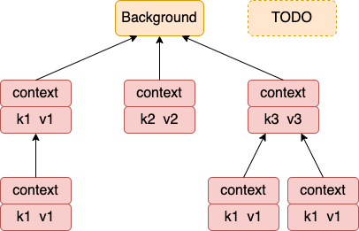

context 主要用来在 goroutine 之间传递上下文信息，包括：取消信号、超时时间、截止时间、k-v 等。

## 一、context 包的使用

### 1.1 取消用法
```golang
func main(){
	ctx1, cancel1 := context.WithCancel(context.Background())
	ctx2, cancel2:= context.WithTimeout(context.Background(), 2*time.Second)

	defer cancel1()
	defer cancel2()

	//Do something
	go func(ctx1)
	go func(ctx2)}
```

### 1.2 传值取值

```golang
func main(){
	ctx := context.WithValue(context.Background(), "userid", "1234567")

}
func handler(ctx context.Context){

}
```

接下来我们来看 context 包的内部工作原理

## 二、所定义的接口

### 2.1  Context 相关的接口

Context 接口定义

```golang
type Context interface {
	Deadline() (deadline time.Time, ok bool)

	//这个 Done方法最重要
	Done() <-chan struct{}

	Err() error

	//Context 接口也定义了 Value 方法
	Value(key interface{}) interface{}
}
```

canceler 接口定义

```golang
//file: context/context.go
type canceler interface {
	cancel(removeFromParent bool, err error)
	Done() <-chan struct{}
}
```

### 2.2 emptyCtx 类型

其中 emptyCtx 实现了 Context 接口，不过所有的方法都是空实现。 

```golang
type emptyCtx int
func (*emptyCtx) Deadline() (deadline time.Time, ok bool) {
	return
}
func (*emptyCtx) Done() <-chan struct{} {
	return nil
}
func (*emptyCtx) Err() error {
	return nil
}
func (*emptyCtx) Value(key interface{}) interface{} {
	return nil
}
```

我们平时所用的 background 和 todo 都是 emptyCtx 的实例。

```golang
var (
	background = new(emptyCtx)
	todo       = new(emptyCtx)
)
func Background() Context {
	return background
}
func TODO() Context {
	return todo
}
```


### 2.3 cancelCtx 类型

cancelCtx 采用匿名嵌套的方式申明了一个 context 成员

> 匿名成员的不代表没有字段名，而是默认会采命名的类型名字作为成员的字段名。在一个结构体中对于每一种数据类型只能有一个匿名字段。


```golang
type cancelCtx struct {
	Context

	mu       sync.Mutex            // protects following fields
	done     chan struct{}         // created lazily, closed by first cancel call
	children map[canceler]struct{} // set to nil by the first cancel call
	err      error                 // set to non-nil by the first cancel call
}
```

同时，它还实现了 Value、Done、Err 中定义的方法。由于没有实现 Deadline， 所以调用这个方法会调用到它的成员 Context 下的 Deadline。 **所以它实现了 Context 接口**。

```golang
func (c *cancelCtx) Value(key interface{}) interface{} {
	if key == &cancelCtxKey {
		return c
	}
	return c.Context.Value(key)
}

func (c *cancelCtx) Done() <-chan struct{} {
	c.mu.Lock()
	if c.done == nil {
		c.done = make(chan struct{})
	}
	d := c.done
	c.mu.Unlock()
	return d
}

func (c *cancelCtx) Err() error {
	c.mu.Lock()
	err := c.err
	c.mu.Unlock()
	return err
}
```

前面看到 cancelCtx 实现了 Done，这里也实现了 cancel。**所以它也实现了 canceler 接口**。 

```golang
// cancel closes c.done, cancels each of c's children, and, if
// removeFromParent is true, removes c from its parent's children.
func (c *cancelCtx) cancel(removeFromParent bool, err error) {
	if err == nil {
		panic("context: internal error: missing cancel error")
	}
	c.mu.Lock()
	if c.err != nil {
		c.mu.Unlock()
		return // already canceled
	}
	c.err = err
	if c.done == nil {
		c.done = closedchan
	} else {
		close(c.done)
	}
	for child := range c.children {
		// NOTE: acquiring the child's lock while holding parent's lock.
		child.cancel(false, err)
	}
	c.children = nil
	c.mu.Unlock()

	if removeFromParent {
		removeChild(c.Context, c)
	}
}
```

### 2.4 timerCtx 类型

```golang
// A timerCtx carries a timer and a deadline. It embeds a cancelCtx to
// implement Done and Err. It implements cancel by stopping its timer then
// delegating to cancelCtx.cancel.
type timerCtx struct {
	cancelCtx
	timer *time.Timer // Under cancelCtx.mu.

	deadline time.Time
}
```

它实现了 Deadline（context接口定义） 、cancel（canceler 接口定义） 等方法。 其它的方法都会进入到匿名成员 cancelCtx 中来调用。

```golang
func (c *timerCtx) Deadline() (deadline time.Time, ok bool) {
	return c.deadline, true
}

func (c *timerCtx) String() string {
	return contextName(c.cancelCtx.Context) + ".WithDeadline(" +
		c.deadline.String() + " [" +
		time.Until(c.deadline).String() + "])"
}

func (c *timerCtx) cancel(removeFromParent bool, err error) {
	c.cancelCtx.cancel(false, err)
	if removeFromParent {
		// Remove this timerCtx from its parent cancelCtx's children.
		removeChild(c.cancelCtx.Context, c)
	}
	c.mu.Lock()
	if c.timer != nil {
		c.timer.Stop()
		c.timer = nil
	}
	c.mu.Unlock()
}
```

### 2.5 cancel 方法调用链


对于 timerCtx 的 cancel 来说，它不但会取消自己，还会取消其内嵌的 cancelCtx 的 cancel 方法。

```golang
func (c *timerCtx) cancel(removeFromParent bool, err error) {
	c.cancelCtx.cancel(false, err)
	if removeFromParent {
		// Remove this timerCtx from its parent cancelCtx's children.
		removeChild(c.cancelCtx.Context, c)
	}
	c.mu.Lock()
	if c.timer != nil {
		c.timer.Stop()
		c.timer = nil
	}
	c.mu.Unlock()
}
```

显示执行 cancelCtx 的 cancel。执行完后， 把自己从其父 context 中的 children 列表中取消 `removeChild(c.cancelCtx.Context, c)`

再看cancelCtx 的 cancel 方法实现如下。

```golang

// cancel closes c.done, cancels each of c's children, and, if
// removeFromParent is true, removes c from its parent's children.
func (c *cancelCtx) cancel(removeFromParent bool, err error) {
	if err == nil {
		panic("context: internal error: missing cancel error")
	}
	c.mu.Lock()
	if c.err != nil {
		c.mu.Unlock()
		return // already canceled
	}
	c.err = err
	if c.done == nil {
		c.done = closedchan
	} else {
		close(c.done)
	}
	for child := range c.children {
		// NOTE: acquiring the child's lock while holding parent's lock.
		child.cancel(false, err)
	}
	c.children = nil
	c.mu.Unlock()

	if removeFromParent {
		removeChild(c.Context, c)
	}
}
```

在 cancelCtx 的 cancel 方法下做了三件事

-1. close 自己的 chanel
-2. 递归地调用它的所有子节点 cancel，进而让它们也能 close 自己的 chanel
-3. 把自己在其父的 context 下取消。`removeChild(c.Context, c)`


### 2.6 valueCtx 类型

用来存储 KV 对儿。其内嵌了一个 Context 类型。

```golang 
type valueCtx struct {
	Context
	key, val interface{}
}
```

其实现了 String 和 Value 两个方法。

```golang
func (c *valueCtx) String() string {
	return contextName(c.Context) + ".WithValue(type " +
		reflectlite.TypeOf(c.key).String() +
		", val " + stringify(c.val) + ")"
}

func (c *valueCtx) Value(key interface{}) interface{} {
	if c.key == key {
		return c.val
	}
	return c.Context.Value(key)
}
```


## 三、函数实现
### 3.1 context.Background 和 context.Todo

直接返回前面定义的两个 emptyCtx 。

```golang
func Background() Context {
	return background
}
func TODO() Context {
	return todo
}
```

### 3.2 WithCancel

它用来创建一个 cancelCtx， 其 parent 是所传入的参数，一般来说，是 BackGround 或者是 Todo。

- 通过调用 newCancelCtx 来创建了一个 cancelCtx 对象。
- 通过调用 propagateCancel 来设置取消链
- 返回 cancelCtx 对象，以及一个匿名函数

**注意：**目测返回的这个 cancelCtx 下面的 done 和 children 元素全部都是 nil。

```golang
func WithCancel(parent Context) (ctx Context, cancel CancelFunc) {
	c := newCancelCtx(parent)
	propagateCancel(parent, &c)
	return &c, func() { c.cancel(true, Canceled) }
}
```

在 newCancelCtx 中创建一个空的 cancelCtx 出来，将 cancelCtx 的成员 Context 设置为了其 parent。

```golang
// newCancelCtx returns an initialized cancelCtx.
func newCancelCtx(parent Context) cancelCtx {
	return cancelCtx{Context: parent}
}
```

根据注释来看， propagateCancel 这个函数是为了做一些准备工作。方便当 parent 取消的时候，新创建出来的 cancelCtx 能够正常取消。 不过如果 parent 是 Background 或者 Todo 的话，这个函数会直接返回。

```golang

// propagateCancel arranges for child to be canceled when parent is.
func propagateCancel(parent Context, child canceler) {

	// parent 为空的话，这里就返回了
	done := parent.Done()
	if done == nil {
		return // parent is never canceled
	}
	...
}
```

最后返回的匿名函数，其实就是下面这个。 defer以后，这个将会执行。

```golang
// cancel closes c.done, cancels each of c's children, and, if
// removeFromParent is true, removes c from its parent's children.
func (c *cancelCtx) cancel(removeFromParent bool, err error) {
	if err == nil {
		panic("context: internal error: missing cancel error")
	}
	c.mu.Lock()
	if c.err != nil {
		c.mu.Unlock()
		return // already canceled
	}
	c.err = err

	//1. 如果有 done channel， 则 close 它一遍。
	if c.done == nil {
		c.done = closedchan
	} else {
		close(c.done)
	}

	//2. 把所有的 child 也都 cancel 一遍（close chan）
	for child := range c.children {
		// NOTE: acquiring the child's lock while holding parent's lock.
		child.cancel(false, err)
	}
	c.children = nil
	c.mu.Unlock()

	// 3. 把自己从 parent 中的 children 列表中摘出来
	//    其中 c.Context 记录着是 parent 指针
	if removeFromParent {
		removeChild(c.Context, c)
	}
}
```


### 3.3 WithTimeout 函数

用法如下。

```golang
//file: main.go
func main(){
	ctx, cancel := context.WithTimeout(context.Background(), 2*time.Second)
	go handle(ctx)
}
```

我们来看看这个函数的内部实现。

```golang
func WithTimeout(parent Context, timeout time.Duration) (Context, CancelFunc) {
	return WithDeadline(parent, time.Now().Add(timeout))
}
```

注意，这里传入的 parent 是 Background， 它并没有 Deadline。所以 parent.Deadline 不会返回 ok 的。

```golang
func WithDeadline(parent Context, d time.Time) (Context, CancelFunc) {
	//1. 先看看 parent 的 Deadline 到了没有
	if cur, ok := parent.Deadline(); ok && cur.Before(d) {
		// The current deadline is already sooner than the new one.
		return WithCancel(parent)
	}

	//2. 初始化一个 timerCtx 对象出来
	//   使用 newCancelCtx 初始化 cancelCtx，deadline 就设置为过期时间
	c := &timerCtx{
		cancelCtx: newCancelCtx(parent),
		deadline:  d,
	}

	//3. 由于 parent 的 Done 方法为空，所以这个函数啥也没干
	propagateCancel(parent, c)

	//4. 获取还有多长时间过期，
	dur := time.Until(d)

	//4.1 如果过期就调用 c.cancel
	//    关于 timerCtx 的 cancel 函数参见下文
	if dur <= 0 {
		c.cancel(true, DeadlineExceeded) // deadline has already passed
		return c, func() { c.cancel(false, Canceled) }
	}

	//4.2 开启timer， 到期后还是调用 timerCtx.cancel 函数
	c.mu.Lock()
	defer c.mu.Unlock()
	if c.err == nil {
		c.timer = time.AfterFunc(dur, func() {
			c.cancel(true, DeadlineExceeded)
		})
	}
	return c, func() { c.cancel(true, Canceled) }
}
```


注意，这里的 c.cancel 方法是 timerCtx 自己重新定义的。

```golang
func (c *timerCtx) cancel(removeFromParent bool, err error) {
	//1. 显式调用内嵌对象的 cancel 方法。
	c.cancelCtx.cancel(false, err)

	//2. 把自己从 parent 的 children 列表中拿出来
	//   其中 c.cancelCtx.Context 记录的是它的 parent
	if removeFromParent {
		// Remove this timerCtx from its parent cancelCtx's children.
		removeChild(c.cancelCtx.Context, c)
	}

	//3. 停止 timer
	c.mu.Lock()
	if c.timer != nil {
		c.timer.Stop()
		c.timer = nil
	}
	c.mu.Unlock()
}
```


### 3.4 WithValue 函数

使用方法

```golang
func main(){
	valueCtx := context.WithValue(context.Background(), "userid", "11111111")
}
```

```golang
func WithValue(parent Context, key, val interface{}) Context {
	if key == nil {
		panic("nil key")
	}
	if !reflectlite.TypeOf(key).Comparable() {
		panic("key is not comparable")
	}
	return &valueCtx{parent, key, val}
}
```

回忆一下 valueCtx 的定义，它是内嵌了一个 Context 对象的。

```golang 
type valueCtx struct {
	Context
	key, val interface{}
}
```

这样返回的对象就是生成一个 valueCtx 对象出来，并用传入的 parent、key、value 来初始化。

如果进行多次的 WithValue 调用，就会把值串成了树形结构。



我们再回顾一下 Value 查看函数的实现。

```golang
func (c *valueCtx) Value(key interface{}) interface{} {
	if c.key == key {
		return c.val
	}
	return c.Context.Value(key)
}
```

先对比当前节点，如果不是自己存着的，就调用父节点进行查找。 如果最后仍然找不到，则调用到根节点 Background 或者 TODO 以后返回 nil。

```golang
func (*emptyCtx) Value(key interface{}) interface{} {
	return nil
}
```